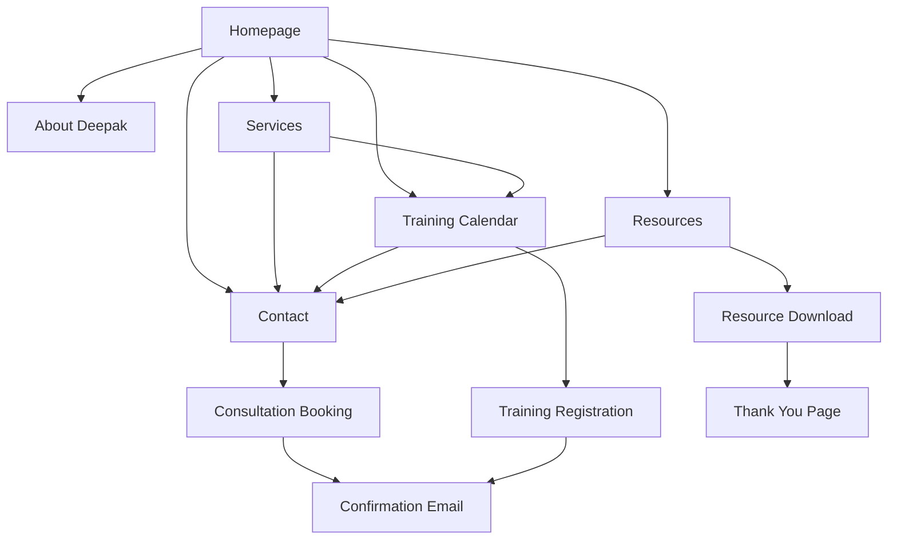

## 1. Product Overview

Deepak Nailwal's agile coaching website is a professional platform designed to showcase his expertise in agile transformation, SAFe® training, and organizational coaching services. The website serves as a central hub for connecting with organizations and professionals seeking expert guidance in their agile journey.

The platform addresses the growing demand for certified SAFe® training and professional agile coaching by providing a comprehensive resource center, training registration system, and consultation booking capabilities. It targets enterprises undergoing digital transformation and professionals seeking career advancement in agile methodologies.

## 2. Core Features

### 2.1 User Roles

| Role | Registration Method | Core Permissions |
|------|---------------------|------------------|
| Visitor | No registration required | Browse content, view training schedules, contact coach |
| Registered User | Email registration with verification | Book training sessions, access member resources, track certifications |
| Corporate Client | Contact form submission + manual verification | Bulk training bookings, customized coaching programs, priority scheduling |

### 2.2 Feature Module

The agile coaching website consists of the following main pages:

1. **Homepage**: Hero section with value proposition, services overview, client testimonials, recent blog posts, and contact call-to-action.
2. **About Deepak**: Professional biography, certifications, experience timeline, coaching philosophy, and professional achievements.
3. **Services**: Detailed service offerings including SAFe® training, agile transformation, team coaching, and enterprise consulting.
4. **Training Calendar**: Upcoming training sessions, registration forms, pricing information, and certification details.
5. **Resources**: Blog articles, whitepapers, case studies, and downloadable agile resources.
6. **Contact**: Contact form, consultation booking, location information, and social media links.

### 2.3 Page Details

| Page Name | Module Name | Feature description |
|-----------|-------------|---------------------|
| Homepage | Hero Section | Display compelling headline, subheadline, and call-to-action button for consultation booking. Include professional headshot and brief value proposition. |
| Homepage | Services Overview | Showcase 3-4 core services with icons, brief descriptions, and "Learn More" links. Implement hover effects for enhanced user engagement. |
| Homepage | Testimonials | Rotating carousel of client testimonials with names, companies, and ratings. Include both individual and corporate client feedback. |
| Homepage | Recent Blog Posts | Display 3 most recent blog articles with featured images, titles, excerpts, and read time. Include "View All Posts" link. |
| About Deepak | Biography Section | Professional background story, mission statement, and coaching approach. Include timeline of certifications and achievements. |
| About Deepak | Certifications Display | Visual showcase of SAFe® certifications, agile coaching credentials, and professional memberships with official logos. |
| About Deepak | Experience Metrics | Interactive counters showing years of experience, number of trained professionals, successful transformations, and client satisfaction rate. |
| Services | Service Cards | Detailed service descriptions with benefits, methodologies, duration, and pricing tiers. Include "Book Consultation" buttons. |
| Services | SAFe® Training Details | Comprehensive information about various SAFe® certifications (SAFe® 6.0, SPC, POPM, etc.) with curriculum outlines and prerequisites. |
| Training Calendar | Upcoming Sessions | Filterable calendar view showing training dates, locations (virtual/physical), available seats, and early-bird pricing deadlines. |
| Training Calendar | Registration Form | Multi-step registration form collecting participant details, company information, dietary restrictions, and payment preferences. |
| Training Calendar | Payment Integration | Secure payment gateway integration supporting credit cards, corporate invoicing, and group booking discounts. |
| Resources | Blog Archive | Categorized blog posts with search functionality, tags, author information, and social sharing buttons. Include comment system. |
| Resources | Download Center | Gated content requiring email registration for whitepapers, templates, and case studies. Track download analytics. |
| Contact | Contact Form | Multi-field form with name, email, phone, company, message, and service interest selection. Include spam protection. |
| Contact | Booking Calendar | Integrated calendar showing Deepak's availability for consultations with automated timezone handling and confirmation emails. |

## 3. Core Process

### Visitor Flow
The visitor journey begins at the homepage where they discover Deepak's expertise through compelling content. They can explore services, read testimonials, and access free resources. The primary conversion goal is booking a consultation through the contact form or scheduling system.

### Registered User Flow
Registered users can access premium content, book training sessions directly, and track their learning progress. They receive personalized recommendations based on their interests and certification history.

### Corporate Client Flow
Corporate clients undergo a qualification process before accessing bulk booking capabilities and customized program development. They receive dedicated account management and priority scheduling.

## 4. User Interface Design

### 4.1 Design Style

**Color Palette:**
- Primary: Deep blue (#1e40af) representing trust and professionalism
- Secondary: Warm orange (#f97316) for energy and innovation
- Accent: Clean white (#ffffff) and light gray (#f8fafc) for modern feel
- Text: Dark gray (#1f2937) for optimal readability

**Typography:**
- Headers: Inter or similar modern sans-serif, bold weights (600-700)
- Body: Inter or system fonts, regular weight (400)
- Font sizes: 16px base, with responsive scaling for mobile devices

**Layout Style:**
- Card-based design with subtle shadows and hover effects
- Generous whitespace for professional appearance
- Grid system with 12-column layout for flexibility
- Sticky navigation header with smooth scroll behavior

**Button Style:**
- Rounded corners (8px radius) for modern appearance
- Primary buttons in brand colors with hover states
- Secondary buttons with outline style
- Consistent padding and typography across all buttons

**Icon Style:**
- Line icons from Heroicons or similar professional set
- Consistent stroke width and visual weight
- Strategic use throughout for visual hierarchy

### 4.2 Page Design Overview

| Page Name | Module Name | UI Elements |
|-----------|-------------|-------------|
| Homepage | Hero Section | Full-width hero with gradient overlay, professional headshot, compelling headline in large typography (48px), subheading (20px), and prominent CTA button. Include subtle animation on scroll. |
| Homepage | Services Overview | Three-column grid layout on desktop, single column on mobile. Each service card features icon, title, brief description, and hover effect with brand color accent. |
| Homepage | Testimonials | Dark background section with white text for contrast. Carousel with navigation dots, client photos, and company logos. Include star ratings and testimonial text in card format. |
| About Deepak | Biography Section | Two-column layout with text on left and professional photo on right. Include timeline visualization for career milestones and certification achievements. |
| Services | Service Cards | Detailed cards with pricing tiers, bullet-point benefits, and "Book Now" buttons. Use accordion-style expandable sections for detailed curriculum information. |
| Training Calendar | Calendar View | Month/week toggle view, color-coded event types, hover tooltips with session details, and filter sidebar for certification types and locations. |
| Resources | Blog Grid | Masonry-style layout for visual interest, featured image thumbnails, reading time indicators, category tags, and pagination for archive pages. |
| Contact | Contact Form | Clean form design with field validation indicators, CAPTCHA integration, and success message display. Include map embed and contact information sidebar. |

### 4.3 Responsiveness

The website follows a mobile-first approach with breakpoints at:
- Mobile: 320px - 767px
- Tablet: 768px - 1023px  
- Desktop: 1024px+

Touch interactions are optimized for mobile devices with larger tap targets, swipe gestures for carousels, and simplified navigation menus. The design maintains visual hierarchy and readability across all screen sizes while prioritizing conversion elements on mobile devices.