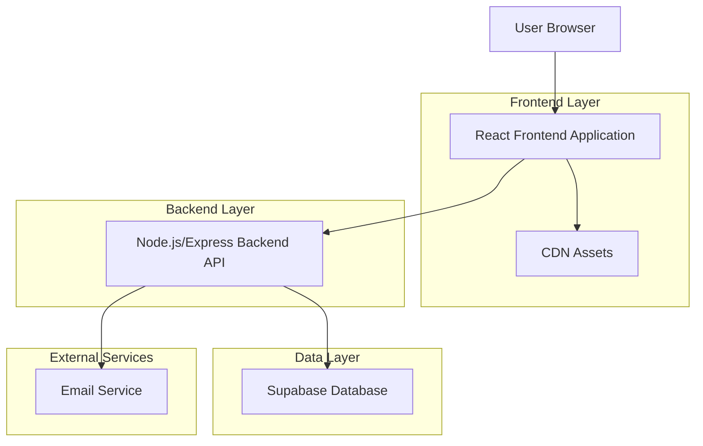
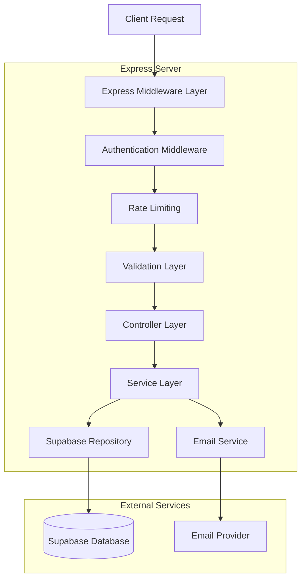
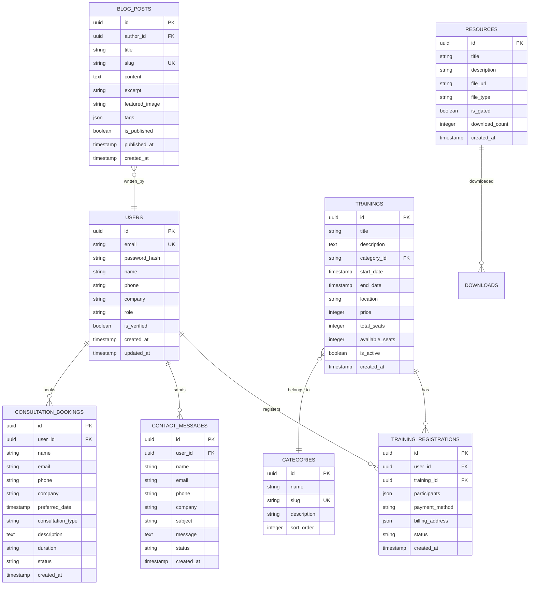

## 1. Architecture Design



## 2. Technology Description

**Frontend Stack:**
- React@18 with TypeScript for type safety and modern development experience
- Vite@4 as build tool for fast development and optimized production builds
- Tailwind CSS@3 for utility-first styling and responsive design
- React Router@6 for client-side routing and navigation
- React Hook Form for efficient form handling and validation
- Framer Motion for smooth animations and micro-interactions

**Backend Stack:**
- Node.js@18 LTS with Express@4 for RESTful API development
- Supabase as Backend-as-a-Service for database, authentication, and storage
- JWT tokens for secure API authentication and session management
- Nodemailer for email notifications and contact form handling
- Express Rate Limit for API protection against abuse

**Development Tools:**
- ESLint and Prettier for code quality and formatting consistency
- Husky for Git hooks and pre-commit validation
- Jest and React Testing Library for unit and integration testing
- Docker for containerization and deployment consistency

## 3. Route Definitions

| Route | Purpose | Component | Layout |
|-------|---------|-----------|---------|
| / | Homepage with hero, services, testimonials, and blog preview | HomePage | MainLayout |
| /about | Deepak's biography, certifications, and experience | AboutPage | MainLayout |
| /services | Detailed service offerings and pricing | ServicesPage | MainLayout |
| /training | Training calendar and registration | TrainingPage | MainLayout |
| /training/:id | Individual training session details | TrainingDetailPage | MainLayout |
| /resources | Blog archive and downloadable resources | ResourcesPage | MainLayout |
| /resources/blog/:slug | Individual blog post with comments | BlogPostPage | MainLayout |
| /resources/download/:id | Resource download page (gated content) | DownloadPage | MainLayout |
| /contact | Contact form and consultation booking | ContactPage | MainLayout |
| /login | User authentication page | LoginPage | AuthLayout |
| /register | User registration page | RegisterPage | AuthLayout |
| /dashboard | User dashboard for bookings and resources | DashboardPage | DashboardLayout |
| /admin/* | Admin panel for content management | AdminRoutes | AdminLayout |
| /404 | Custom 404 error page | NotFoundPage | MinimalLayout |

## 4. API Definitions

### 4.1 Authentication APIs

```
POST /api/auth/register
```

**Request:**
| Param Name | Param Type | isRequired | Description |
|------------|------------|------------|-------------|
| email | string | true | User email address |
| password | string | true | Minimum 8 characters |
| name | string | true | Full name |
| company | string | false | Company name |
| phone | string | false | Contact phone number |

**Response:**
```json
{
  "success": true,
  "data": {
    "user": {
      "id": "uuid",
      "email": "user@example.com",
      "name": "John Doe",
      "role": "user"
    },
    "token": "jwt_token_string"
  }
}
```

```
POST /api/auth/login
```

**Request:**
| Param Name | Param Type | isRequired | Description |
|------------|------------|------------|-------------|
| email | string | true | User email address |
| password | string | true | User password |

**Response:**
```json
{
  "success": true,
  "data": {
    "user": {
      "id": "uuid",
      "email": "user@example.com",
      "name": "John Doe",
      "role": "user"
    },
    "token": "jwt_token_string"
  }
}
```

### 4.2 Training APIs

```
GET /api/trainings
```

**Query Parameters:**
| Param Name | Param Type | Description |
|------------|------------|-------------|
| category | string | Filter by training category |
| date_from | string | Start date filter (ISO 8601) |
| date_to | string | End date filter (ISO 8601) |
| location | string | Filter by location (virtual/physical) |
| page | number | Pagination page number |
| limit | number | Items per page |

**Response:**
```json
{
  "success": true,
  "data": {
    "trainings": [
      {
        "id": "uuid",
        "title": "SAFe® 6.0 POPM Training",
        "description": "Product Owner/Product Manager certification",
        "date": "2024-01-15T09:00:00Z",
        "duration": "2 days",
        "price": 1299,
        "location": "Virtual",
        "available_seats": 15,
        "total_seats": 20
      }
    ],
    "pagination": {
      "page": 1,
      "limit": 10,
      "total": 25,
      "pages": 3
    }
  }
}
```

```
POST /api/trainings/:id/register
```

**Request Headers:**
```
Authorization: Bearer jwt_token_string
```

**Request Body:**
| Param Name | Param Type | isRequired | Description |
|------------|------------|------------|-------------|
| participants | array | true | Array of participant objects |
| payment_method | string | true | "credit_card" or "invoice" |
| billing_address | object | true | Billing address information |
| special_requests | string | false | Any special requirements |

### 4.3 Contact APIs

```
POST /api/contact
```

**Request:**
| Param Name | Param Type | isRequired | Description |
|------------|------------|------------|-------------|
| name | string | true | Contact name |
| email | string | true | Contact email |
| phone | string | false | Phone number |
| company | string | false | Company name |
| subject | string | true | Message subject |
| message | string | true | Message content |
| service_interest | string | false | Interested service type |
| preferred_contact | string | false | "email" or "phone" |

**Response:**
```json
{
  "success": true,
  "data": {
    "message_id": "uuid",
    "status": "received",
    "response_time": "within 24 hours"
  }
}
```

```
POST /api/consultation/book
```

**Request:**
| Param Name | Param Type | isRequired | Description |
|------------|------------|------------|-------------|
| name | string | true | Client name |
| email | string | true | Client email |
| phone | string | true | Phone number |
| company | string | true | Company name |
| preferred_date | string | true | Preferred consultation date |
| alternative_dates | array | false | Alternative date options |
| consultation_type | string | true | "individual" or "corporate" |
| description | string | true | Brief description of needs |
| duration | string | false | "30min", "60min", or "90min" |

## 5. Server Architecture Diagram



## 6. Data Model

### 6.1 Data Model Definition



### 6.2 Data Definition Language

**Users Table:**
```sql
CREATE TABLE users (
  id UUID PRIMARY KEY DEFAULT gen_random_uuid(),
  email VARCHAR(255) UNIQUE NOT NULL,
  password_hash VARCHAR(255) NOT NULL,
  name VARCHAR(100) NOT NULL,
  phone VARCHAR(20),
  company VARCHAR(255),
  role VARCHAR(20) DEFAULT 'user' CHECK (role IN ('user', 'admin')),
  is_verified BOOLEAN DEFAULT false,
  created_at TIMESTAMP WITH TIME ZONE DEFAULT NOW(),
  updated_at TIMESTAMP WITH TIME ZONE DEFAULT NOW()
);

CREATE INDEX idx_users_email ON users(email);
CREATE INDEX idx_users_role ON users(role);
```

**Trainings Table:**
```sql
CREATE TABLE trainings (
  id UUID PRIMARY KEY DEFAULT gen_random_uuid(),
  title VARCHAR(255) NOT NULL,
  description TEXT NOT NULL,
  category_id UUID REFERENCES categories(id),
  start_date TIMESTAMP WITH TIME ZONE NOT NULL,
  end_date TIMESTAMP WITH TIME ZONE NOT NULL,
  location VARCHAR(255) NOT NULL,
  price INTEGER NOT NULL,
  total_seats INTEGER NOT NULL,
  available_seats INTEGER NOT NULL,
  is_active BOOLEAN DEFAULT true,
  created_at TIMESTAMP WITH TIME ZONE DEFAULT NOW()
);

CREATE INDEX idx_trainings_start_date ON trainings(start_date);
CREATE INDEX idx_trainings_category ON trainings(category_id);
CREATE INDEX idx_trainings_active ON trainings(is_active);
```

**Training Registrations Table:**
```sql
CREATE TABLE training_registrations (
  id UUID PRIMARY KEY DEFAULT gen_random_uuid(),
  user_id UUID REFERENCES users(id) ON DELETE CASCADE,
  training_id UUID REFERENCES trainings(id) ON DELETE CASCADE,
  participants JSONB NOT NULL,
  payment_method VARCHAR(50) NOT NULL CHECK (payment_method IN ('credit_card', 'invoice')),
  billing_address JSONB NOT NULL,
  status VARCHAR(50) DEFAULT 'pending' CHECK (status IN ('pending', 'confirmed', 'cancelled')),
  created_at TIMESTAMP WITH TIME ZONE DEFAULT NOW(),
  UNIQUE(user_id, training_id)
);

CREATE INDEX idx_registrations_user ON training_registrations(user_id);
CREATE INDEX idx_registrations_training ON training_registrations(training_id);
CREATE INDEX idx_registrations_status ON training_registrations(status);
```

**Contact Messages Table:**
```sql
CREATE TABLE contact_messages (
  id UUID PRIMARY KEY DEFAULT gen_random_uuid(),
  user_id UUID REFERENCES users(id) ON DELETE SET NULL,
  name VARCHAR(255) NOT NULL,
  email VARCHAR(255) NOT NULL,
  phone VARCHAR(20),
  company VARCHAR(255),
  subject VARCHAR(255) NOT NULL,
  message TEXT NOT NULL,
  status VARCHAR(50) DEFAULT 'new' CHECK (status IN ('new', 'read', 'responded')),
  created_at TIMESTAMP WITH TIME ZONE DEFAULT NOW()
);

CREATE INDEX idx_contact_email ON contact_messages(email);
CREATE INDEX idx_contact_status ON contact_messages(status);
CREATE INDEX idx_contact_created ON contact_messages(created_at);
```

**Blog Posts Table:**
```sql
CREATE TABLE blog_posts (
  id UUID PRIMARY KEY DEFAULT gen_random_uuid(),
  author_id UUID REFERENCES users(id),
  title VARCHAR(255) NOT NULL,
  slug VARCHAR(255) UNIQUE NOT NULL,
  content TEXT NOT NULL,
  excerpt TEXT,
  featured_image VARCHAR(500),
  tags JSONB DEFAULT '[]',
  is_published BOOLEAN DEFAULT false,
  published_at TIMESTAMP WITH TIME ZONE,
  created_at TIMESTAMP WITH TIME ZONE DEFAULT NOW(),
  updated_at TIMESTAMP WITH TIME ZONE DEFAULT NOW()
);

CREATE INDEX idx_blog_slug ON blog_posts(slug);
CREATE INDEX idx_blog_published ON blog_posts(is_published);
CREATE INDEX idx_blog_published_at ON blog_posts(published_at);
```

**Supabase Row Level Security (RLS) Policies:**

```sql
-- Enable RLS on all tables
ALTER TABLE users ENABLE ROW LEVEL SECURITY;
ALTER TABLE trainings ENABLE ROW LEVEL SECURITY;
ALTER TABLE training_registrations ENABLE ROW LEVEL SECURITY;
ALTER TABLE contact_messages ENABLE ROW LEVEL SECURITY;
ALTER TABLE blog_posts ENABLE ROW LEVEL SECURITY;

-- Grant basic read access to anonymous users
GRANT SELECT ON trainings TO anon;
GRANT SELECT ON blog_posts TO anon;

-- Grant full access to authenticated users
GRANT ALL PRIVILEGES ON training_registrations TO authenticated;
GRANT ALL PRIVILEGES ON contact_messages TO authenticated;

-- Create policies for row-level security
CREATE POLICY "Users can view their own registrations" ON training_registrations
  FOR SELECT USING (auth.uid() = user_id);

CREATE POLICY "Users can create registrations" ON training_registrations
  FOR INSERT WITH CHECK (auth.uid() = user_id);

CREATE POLICY "Public can view published blog posts" ON blog_posts
  FOR SELECT USING (is_published = true);
```

## 7. Deployment Considerations

**Frontend Deployment:**
- Build optimized production bundle using Vite
- Deploy to Vercel or Netlify for automatic CI/CD
- Configure environment variables for API endpoints
- Implement service worker for offline capabilities
- Set up custom domain with SSL certificate

**Backend Deployment:**
- Containerize Node.js application using Docker
- Deploy to cloud platform (Railway, Render, or DigitalOcean)
- Configure environment variables for Supabase connection
- Implement health checks and monitoring
- Set up log aggregation for debugging

**Database Management:**
- Use Supabase managed PostgreSQL for reliability
- Implement backup strategies and point-in-time recovery
- Monitor query performance and optimize indexes
- Set up connection pooling for high traffic

**Security Implementation:**
- Implement rate limiting on all API endpoints
- Use HTTPS for all communications
- Sanitize user inputs to prevent XSS attacks
- Implement CSRF protection for state-changing operations
- Regular security audits and dependency updates

**Performance Optimization:**
- Implement caching strategies for static content
- Use CDN for asset delivery
- Optimize images with next-gen formats (WebP, AVIF)
- Implement lazy loading for images and components
- Minimize JavaScript bundle size with code splitting